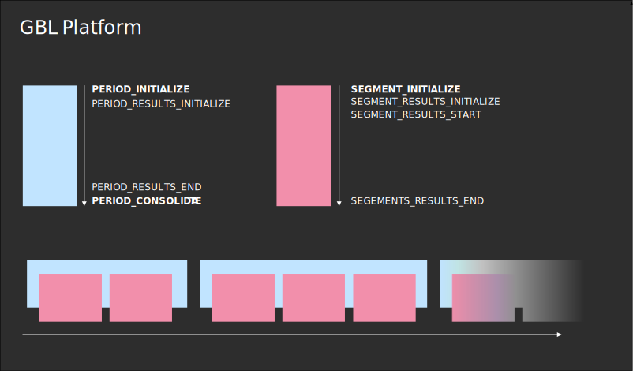

# GAME

This is a step by step explanation on how to implement a game using the uzh-gbl-platform packag along with the demo-game as a starer template.

## Getting started

### Github authentification:

1. Duplicate ``.env.local.template`` and rename it to ``.env.local``
2. On github navigate to settings -> developer settings -> Github Apps -> New Github app. Then use the following settings:
    - Homepage URL: http://localhost:3000/
    - Callback URL: http://localhost:3000/api/auth/callback/github
    - Disable webhooks
3. Then in your app settings copy the Client ID key which looks somethings like  Iv1.1234... and paste it to .env.local after GITHUB_ID=
4. Click generate a new client secret and paste it to GITHUB_SECRET=
5. Generate a new cryptographically safe string and paste it to NEXTAUTH_SECRET= (You can use any string you want but it is recommended to use a cryptographically safe string)


### Dependencies

#### Linux based systems

- Install docker
- Install node.js
- execute ``npm install`` in a terminal from the root directory of the code. ``package.json`` should be located inside the root.

#### Windows

- Install docker desktop
- Install node.js
- execute ``npm install`` in a terminal from the root directory of the code. ``package.json`` should be located inside the root.

### Starting the application locally


#### Linux based systems

- ``sudo service docker start && sudo docker compose up``

In a new terminal:

- ``npm run dev``

#### Windows

- Open docker desktop and make sure it is working
- ``docker compose up``


In a new terminal:

- ``npm run dev``

### Troubleshooting

- **Reseting the database**

    - ``npm run prisma:reset`` Reset the database
    - ``npm run prisma:generate`` Generate files (schemas) to ``prisma/generated``
    - ``npm run prisma:push`` Push the schema to the database

- **Login token expired**: Sometimes the login token expires. To fix this, navigate to ``<url>/admin/login`` and then login again. Try to delete the cookies for the page an refresh the page.

- **npm packages**: Sometimes the npm packages are not installed correctly. To fix this, run ``npm install`` in the root directory of the code.

---

## Implementation

The game is composed of a backend running in a Docker container and a web app that generates the frontend. For the backend you only need to configure the types as found in the folder ``src/graphql/types`` and the reducers as found in ``src/reducers``. Prisma then auto generates the database from the defined types, whereas the reducers act as server side function which are executed for different actions performed. Theese actions can either be triggered by a user or admin action. The actions can then be accessed by the fronte end. The fronted is a react app and its pages and components are found in 
``src/components`` and ``src/pages``. 

### Terminology
- **Admin**: The person responsible for managing games, including creating new games and controlling the flow of running games.
- **Player**: Someone who joins and plays a game set up by the admin.
- **Period**: A game can have multiple periods, each of which consists of multiple Segments. The game state can be adjusted at the beginning and end of each period.
- **Segment**: The smallest unit of time in the game. The game state can be adjusted at the start and end of each segment, as well as when it is initialized.
- **Results**: The results of a period are the results of all segments in that period. The results of a segment are the results of all actions in that segment.
- **Facts**: 



## How to implement the database

### Schema

The database schema is defined in ``src/graphql/types``. The most important file is ``src/graphql/types/Period.ts``, here all we define PeriodFactsInput, PeriodSegmentFactsScema, PeriodSegmentFacts and PeriodSegmentFactsInput. 

### Reducers

Reducers are functions that are executed on the server in response to user interactions. These functions can alter the game state by defining different actions. Reducers can be divided into four types:

#### PeriodReducers
Period reducers are a set of functions that are executed for each status change of a period. These functions are defined in an ActionTypes enumeration inside *PeriodReducers.ts* and include the following actions:

````javascript
export enum ActionTypes {
  PERIOD_INITIALIZE = 'PERIOD_INITIALIZE',
  PERIOD_CONSOLIDATE = 'PERIOD_CONSOLIDATE',
}
````

- *Period Initialize* is called as soon as te *admin* creates a new period in the admin interface. 
- *Period Consolidate* is called TODO

#### PerdiodResultReducer
The Period Result Reducers are a set of action which are called when the results of a period are changed. 

````javascript
export enum ActionTypes {
  PERIOD_RESULTS_INITIALIZE = 'PERIOD_RESULTS_INITIALIZE',
  PERIOD_RESULTS_START = 'PERIOD_RESULTS_START',
  PERIOD_RESULTS_END = 'PERIOD_RESULTS_END',
}
````
- *Period Result Initialize* is called as soon as a period is actually started.
- *Period Result Start* TODO
- *Period Result End* is called when the period is ended by the admin.


#### SegmentReducers

````javascript
export enum ActionTypes {
  SEGMENT_INITIALIZE = 'SEGMENT_INITIALIZE',
}
````
- *Segment Initialize* is called as soon as a new segmenet is created by the *admin* of the game. 

#### ActionReducers
Are called each time an action is performed by an user. Lets say we program a chess app then we have an action called *move* which is called each time a user moves a piece. While the other reducers are identical for each game, the action reducers are different for each game.

````javascript

````javascript	
export enum ActionTypes {
  ACTION_MOVE = 'ACTION_MOVE',
}
````	

- *Action Move* is called each time a user moves a piece in a chess game.
