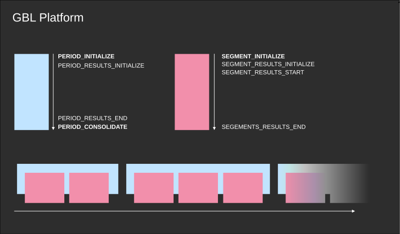

# GAME

> [!NOTE]
> Parts of this README are outdated (the reducer terminology below predates the current `Services` contract). The maintained documentation for building games on the platform is the wiki at [`docs/`](../../docs/index.md); local dev setup is covered by the devcontainer configs (see below). New to all of this? Start at [`docs/getting-started.md`](../../docs/getting-started.md).

This is a step by step explanation on how to implement a game using the uzh-gbl-platform packag along with the demo-game as a starer template.

## Getting started

### Authentication

Admin login uses the NextAuth Auth0 provider in the app code.

Local development through devcontainer/devrouter uses mocked OIDC, not real
Auth0. The committed devcontainer environment points `AUTH0_ISSUER` at the local
`mock-oauth2-server` sidecar, so admin login works through the routed local mock
issuer at `https://oidc.demo-game.localhost/default`.

Only use a real Auth0 application for a manual local setup without the
devcontainer/devrouter mock:

1. Duplicate `.env.local.template` and rename it to `.env.local`.
2. Create an Auth0 application and configure:
   - Application login URL: http://localhost:3000/admin/login
   - Allowed callback URL: http://localhost:3000/api/auth/callback/auth0
   - Allowed logout URL: http://localhost:3000/
3. Copy the Auth0 client ID to `AUTH0_CLIENT_ID=`.
4. Copy the Auth0 client secret to `AUTH0_CLIENT_SECRET=`.
5. Copy the Auth0 issuer URL to `AUTH0_ISSUER=`.
6. Generate a cryptographically safe string and paste it to `NEXTAUTH_SECRET=`
   (for example with `openssl rand -base64 32`).

### Local development

Use a devcontainer — everything (Postgres, mock OIDC login, install/build/seed, dev server) is automatic:

- **Starter configuration** (`.devcontainer/starter/`) — only Docker + VS Code needed; walkthrough in [`docs/getting-started.md`](../../docs/getting-started.md).
- **devrouter configuration** (`.devcontainer/`) — multi-project routing for maintainers; see [`.devcontainer/README.md`](../../.devcontainer/README.md).

If the environment misbehaves, use the `gbl-environment-doctor` skill (`.agents/skills/gbl-environment-doctor/`).

---

## Implementation

The game is composed of a backend running in a Docker container and a web app that generates the frontend. The database automatically adapts to the reducers `src/reducers`, which are a set of functions each of which are defined on a specific action. An action can be triggered by a user (or player) of the game or the admin who manages the game. For each object in the database a specific initiialize reducer initializes the object on the database. The developer therefore does not need to specify any database schemas manually.

The frontend is generated using React and Next.js. The frontend is located in the
`src/components` and `src/pages` folders, whereas actions are triggered with javascript calls. The actions in turn trigger the reducers on the backend.

### Terminology

- **Admin**: The person responsible for managing games, including creating new games and controlling the flow of running games.
- **Player**: Someone who joins and plays a game set up by the admin.
- **Period**: A game can have multiple periods, each of which consists of multiple Segments. The game state can be adjusted at the beginning and end of each period.
- **Segment**: The smallest unit of time in the game. The game state can be adjusted at the start and end of each segment, as well as when it is initialized.
- **Results**: The results of a period are the results of all segments in that period. The results of a segment are the results of all actions in that segment.
- **Facts**:



## How to implement the database

### Schema

The database schema is defined in `src/graphql/types`. The most important file is `src/graphql/types/Period.ts`, here all we define PeriodFactsInput, PeriodSegmentFactsScema, PeriodSegmentFacts and PeriodSegmentFactsInput.

### Reducers

Reducers are functions that are executed on the server in response to user interactions. These functions can alter the game state by defining different actions. Reducers can be divided into four types:

#### PeriodReducers

Period reducers are a set of functions that are executed for each status change of a period. These functions are defined in an ActionTypes enumeration inside _PeriodReducers.ts_ and include the following actions:

```javascript
export enum ActionTypes {
  PERIOD_INITIALIZE = 'PERIOD_INITIALIZE',
  PERIOD_CONSOLIDATE = 'PERIOD_CONSOLIDATE',
}
```

- _Period Initialize_ is called as soon as te _admin_ creates a new period in the admin interface.
- _Period Consolidate_ is called TODO

#### PerdiodResultReducer

The Period Result Reducers are a set of action which are called when the results of a period are changed.

```javascript
export enum ActionTypes {
  PERIOD_RESULTS_INITIALIZE = 'PERIOD_RESULTS_INITIALIZE',
  PERIOD_RESULTS_START = 'PERIOD_RESULTS_START',
  PERIOD_RESULTS_END = 'PERIOD_RESULTS_END',
}
```

- _Period Result Initialize_ is called as soon as a period is actually started.
- _Period Result Start_ TODO
- _Period Result End_ is called when the period is ended by the admin.

#### SegmentReducers

```javascript
export enum ActionTypes {
  SEGMENT_INITIALIZE = 'SEGMENT_INITIALIZE',
}
```

- _Segment Initialize_ is called as soon as a new segmenet is created by the _admin_ of the game.

#### ActionReducers

Are called each time an action is performed by an user. Lets say we program a chess app then we have an action called _move_ which is called each time a user moves a piece. While the other reducers are identical for each game, the action reducers are different for each game.

`````javascript

````javascript
export enum ActionTypes {
  ACTION_MOVE = 'ACTION_MOVE',
}
`````

- _Action Move_ is called each time a user moves a piece in a chess game.
