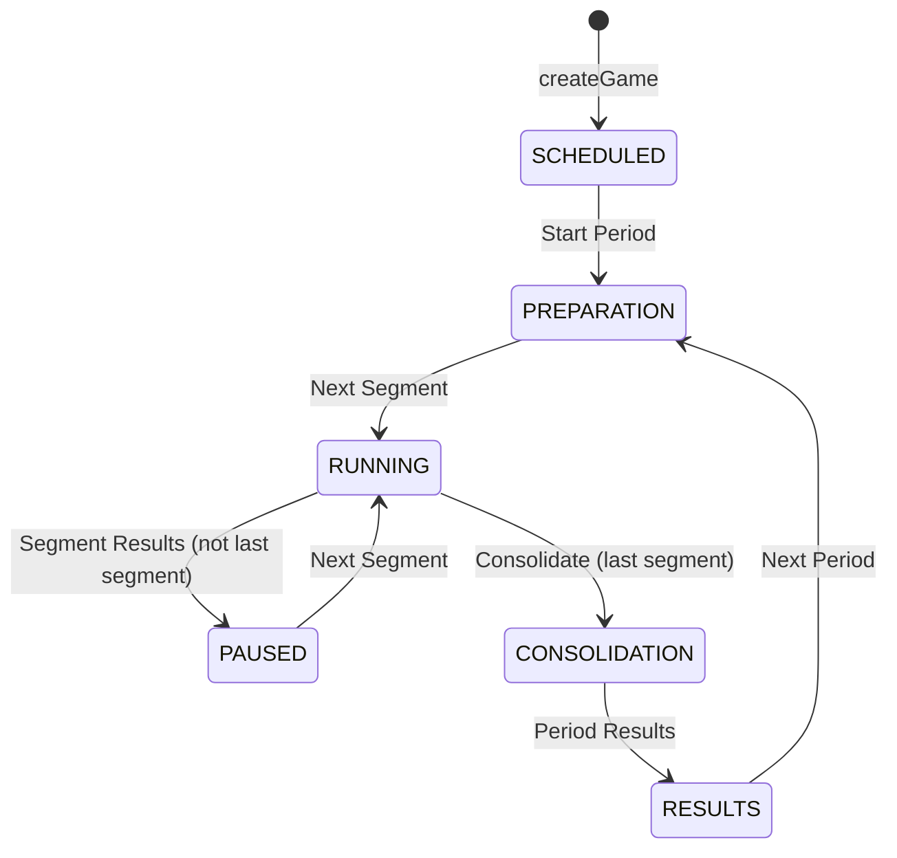

# Game Lifecycle

The whole game runs on **one shared state machine per game** (`Game.status` plus the active period/segment pointers from [game-model.md](game-model.md)). Every transition is triggered by an admin clicking one button; it applies to all players at once. This is what "synchronous" means on this platform — there is no per-player pacing.

Engine: `packages/platform/src/services/GameService.ts` — two driver mutations, `activateNextPeriod` and `activateNextSegment`, each a `switch` over the current status.

## State machine

`COMPLETED` exists in the `GameStatus` enum but **no code path currently sets it** (only commented-out TODOs in `GameService.ts`) — after the final period the game simply stays in `RESULTS`.

## Transition table

Button labels from the admin cockpit (`apps/demo-game/src/pages/admin/games/[id].tsx:getButton`); computations are what the platform runs during the transition, calling the game's hooks ([developing-a-game.md](developing-a-game.md)).

| From → To               | Admin button      | Mutation              | Platform work and game hooks called                                                                                                                                               |
| ----------------------- | ----------------- | --------------------- | --------------------------------------------------------------------------------------------------------------------------------------------------------------------------------- |
| SCHEDULED → PREPARATION | "Start Period"    | `activateNextPeriod`  | Activates period 0; writes `PERIOD_START` results per player via `PeriodResult.initialize`/`.start`                                                                               |
| PREPARATION → RUNNING   | "Next Segment"    | `activateNextSegment` | Activates next segment; writes `SEGMENT_START` + working `SEGMENT_END` rows via `SegmentResult.initialize`/`.start`; resets all `isReady`                                         |
| RUNNING → PAUSED        | "Segment Results" | `activateNextSegment` | Closes the segment: `Segment.updateDBBeforeActivation` hook (if any), then `SegmentResult.end` per player finalizes `SEGMENT_END` facts; resets `isReady`                         |
| PAUSED → RUNNING        | "Next Segment"    | `activateNextSegment` | Same as PREPARATION → RUNNING, for the next segment                                                                                                                               |
| RUNNING → CONSOLIDATION | "Consolidate"     | `activateNextPeriod`  | Only on the **last** segment: closes it (`SegmentResult.end`), then `Period.consolidate` updates period facts; resets `isReady`                                                   |
| CONSOLIDATION → RESULTS | "Period Results"  | `activateNextPeriod`  | `PeriodResult.end` per player (gets segment-end results, other players' results, consolidation decisions) writes `PERIOD_END` rows; optional `PeriodResult.updateDBAfterEnd` hook |
| RESULTS → PREPARATION   | "Next Period"     | `activateNextPeriod`  | Advances `activePeriodIx`; writes `PERIOD_START` rows for the new period via `PeriodResult.start`                                                                                 |

Notes:

- The "Consolidate" button appears when the game is RUNNING **and** the active segment is the last one (`activeSegmentIx >= segments.length - 1` with `segmentCount` reached) — and it calls `activateNextPeriod`, not `activateNextSegment`.
- Periods and segments are **authored during play or before**: "Add period" (with per-period facts, e.g. a market scenario) and "Add segment" (with attached learning/story elements). Segment facts (e.g. random returns) are computed at _creation_ time by `Segment.initialize`, not at activation time.
- Segment/period transitions reset `Player.isReady` to false for the whole game. (Exception: the initial SCHEDULED → PREPARATION has no explicit reset — players start at `false` anyway.)

## What players see per status

The player cockpit is a single page that switches on `game.status` (`apps/demo-game/src/pages/play/cockpit.tsx`):

| Status                 | Player view                                                                             |
| ---------------------- | --------------------------------------------------------------------------------------- |
| SCHEDULED              | "Game is scheduled" placeholder                                                         |
| PREPARATION            | Header only — waiting while the admin sets up                                           |
| RUNNING                | The decision form (game-specific), plus a Ready toggle                                  |
| PAUSED / CONSOLIDATION | Read-only segment results OR active period consolidation forms (e.g. investing in factories, setting dividends for the period) |
| RESULTS                | Period-end report: aggregate charts across the period(s)                                |

Independent of status: story elements attached to a newly activated segment appear as blocking popups until acknowledged; learning elements sit in a sidebar list; achievements/level-ups arrive as notifications.

## Coordination mechanics (all advisory)

- **Ready flag** — players toggle "Ready" after acting (`updateReadyState`). The admin UI plays a sound and shows "All players are ready!" but the platform never blocks or auto-advances on it.
- **Countdown** — the admin can set a countdown on the active segment (`addCountdown`); players see a ticking widget and warning toasts. When it expires **nothing happens automatically** — the admin still clicks the button. Treat it as social pressure, not enforcement.
- **Realtime** — every transition publishes a global event (`PERIOD_ACTIVATED`, `SEGMENT_ACTIVATED`, `COUNTDOWN_UPDATED`, ...). Clients use these purely as a signal to refetch their queries — no payload is trusted. See [api-layer.md](api-layer.md).

## End-to-end walkthrough

Verified by `playwright/tests/demo-game-flow.spec.ts`:

1. Admin signs in (`/admin/login`, OIDC) and creates a game with a name and player count. The platform creates one `Player` row per team with a unique login token. Status: `SCHEDULED`.
2. Admin adds one or more periods (per-period facts/scenario) and their segments (optionally attaching story/learning elements).
3. Admin distributes each team's join link (`/join/<token>`) — shown next to each player in the game detail page.
4. Players open their link → logged in without a password → land on a welcome page to pick a team name/avatar → arrive at the cockpit.
5. Admin: **Start Period** → `PREPARATION`; then **Next Segment** → `RUNNING`.
6. Players submit their decision(s) for the segment and toggle Ready. Optionally the admin sets a countdown.
7. Admin advances through the transition table above: **Segment Results** / **Next Segment** per segment, **Consolidate** + **Period Results** on the last one, **Next Period** to loop back to step 5 for the next period.
8. After the final period, the admin opens the report dashboard (`/admin/reports/[id]`) for cross-period analytics; the game remains in `RESULTS` (no `COMPLETED` transition today).
