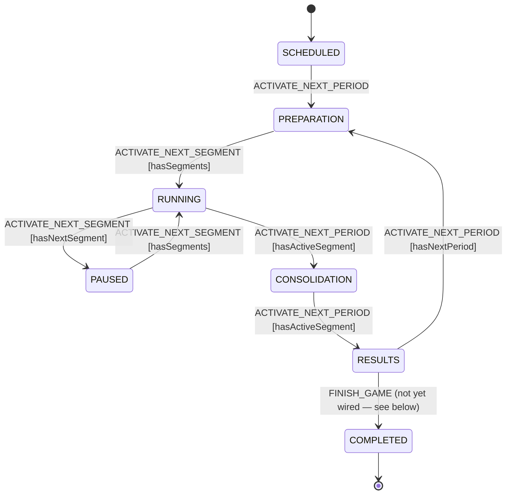

# Game lifecycle state machine

`gameMachine.ts` is the explicit XState v5 model of the game lifecycle that was
previously implicit in the `switch (game.status)` blocks of
`GameService.activateNextPeriod` and `GameService.activateNextSegment`.

It is kept in lock-step with the declarative transition table in
[`../services/GameTransitions.ts`](../services/GameTransitions.ts) — a unit test
(`gameMachine.test.ts`) asserts the machine and table agree for every
state/event/context combination.

## States and events

- **States** map one-to-one to the `GameStatus` enum: `SCHEDULED`,
  `PREPARATION`, `RUNNING`, `PAUSED`, `CONSOLIDATION`, `RESULTS`, `COMPLETED`.
- **Events** are the two admin-triggered GraphQL mutations: `ACTIVATE_NEXT_PERIOD`
  (→ `activateNextPeriod`) and `ACTIVATE_NEXT_SEGMENT` (→ `activateNextSegment`).
- **Guards** read a small context derived from the database
  (`buildTransitionContext`): `segmentCount`, `hasActiveSegment`,
  `hasNextSegment`, `activePeriodIx`, `totalPeriods`.

The machine is not persisted in its own column: its state value is exactly
`game.status` and its context is fully derived from the game's periods/segments,
so the database row already is the machine's persisted state. Reconstruct an
actor on demand with `GameMachineService.hydrateGameActor(game)`.

## Diagram

## Visual insight ("the XState UI")

The machine is plain XState v5 (`setup().createMachine`), so it works directly
with the official tooling:

- **Stately Studio** (<https://stately.ai/editor>) — paste the contents of
  `gameMachine.ts`, or import it from a connected repository, to get a live,
  editable statechart. This is the recommended way to explore and discuss the
  lifecycle, and it needs no runtime integration.
- **Stately VS Code extension** — open `gameMachine.ts` to render the same
  diagram inline while editing.
- **Live inspector** (`@statelyai/inspect`) — useful for stepping a running
  actor in the browser during local development. Note: it is a development tool
  only and forwards machine context to Stately's servers, so it must never be
  enabled against real game data. It is intentionally not wired into the app
  bundle (the machine imports `@prisma/client`, which is server-only).
- For driving admin controls in production, prefer
  `GameMachineService.getGameLifecycleState(game)`, which returns the currently
  valid transitions without any visual tooling.

## Not yet wired: `COMPLETED`

`COMPLETED` exists as a final state but is not yet reachable. Reaching it is not
a one-line guard change because `activePeriodIx` is advanced early (during
`CONSOLIDATION → RESULTS`), which makes the final results phase indistinguishable
from an intermediate one by index alone, and the last period's
`CONSOLIDATION → RESULTS` currently attempts to connect a non-existent next
period. Completing a game cleanly should be a dedicated change (e.g. a
`FINISH_GAME` admin action, plus disambiguating the active-period index) with
end-to-end tests, and is tracked separately.
