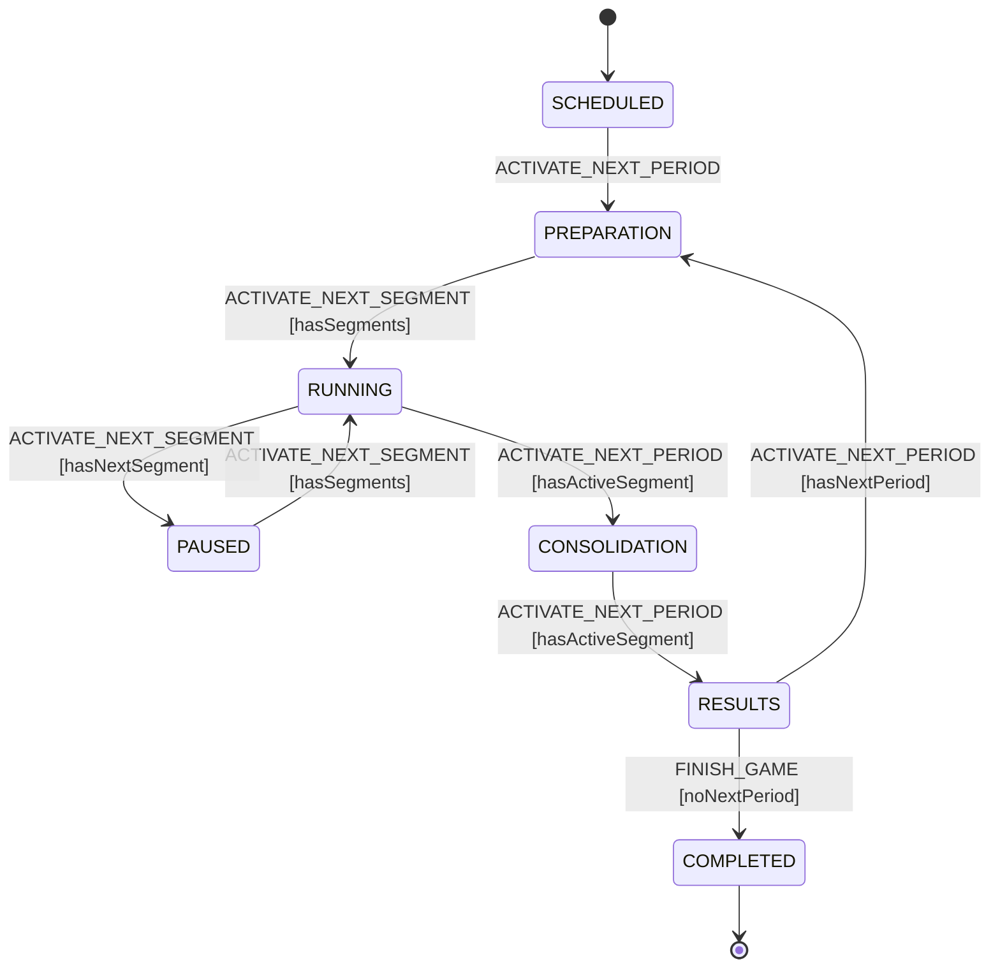

# Game lifecycle state machine

`gameMachine.ts` is the explicit XState v5 model of the game lifecycle that was
previously implicit in the `switch (game.status)` blocks of
`GameService.activateNextPeriod` and `GameService.activateNextSegment`.

It is kept in lock-step with the declarative transition table in
[`../services/GameTransitions.ts`](../services/GameTransitions.ts) — a unit test
(`gameMachine.test.ts`) asserts the machine and table agree for every
state/event/context combination.

`GameService` now **drives** transitions from this model: `activateNextPeriod` /
`activateNextSegment` ask `GameTransitions.nextStatus(status, event, ctx)` for
the validity and target of the transition, return early (no-op) when there is no
valid transition, and write the machine-supplied `targetStatus`. The `switch`
remains only to select the side-effects (result computation, DB writes) for the
already-validated transition. Setting `XSTATE_SHADOW=true` enables a post-commit
invariant check that the persisted `game.status` matches the machine target.

## States and events

- **States** map one-to-one to the `GameStatus` enum: `SCHEDULED`,
  `PREPARATION`, `RUNNING`, `PAUSED`, `CONSOLIDATION`, `RESULTS`, `COMPLETED`.
- **Events** are the two admin-triggered GraphQL mutations: `ACTIVATE_NEXT_PERIOD`
  (→ `activateNextPeriod`) and `ACTIVATE_NEXT_SEGMENT` (→ `activateNextSegment`).
- **Guards** read a small context derived from the database
  (`buildTransitionContext`): `segmentCount`, `hasActiveSegment`,
  `hasNextSegment`, `activePeriodIx`, `totalPeriods`.

The machine is not persisted in its own column: its state value is exactly
`game.status` and its context is fully derived from the game's periods/segments,
so the database row already is the machine's persisted state. Reconstruct an
actor on demand with `GameMachineService.hydrateGameActor(game)`.

## Diagram

## Visual insight ("the XState UI")

The machine is plain XState v5 (`setup().createMachine`), so it works directly
with the official tooling:

- **Stately Studio** (<https://stately.ai/editor>) — paste the contents of
  `gameMachine.ts`, or import it from a connected repository, to get a live,
  editable statechart. This is the recommended way to explore and discuss the
  lifecycle, and it needs no runtime integration.
- **Stately VS Code extension** — open `gameMachine.ts` to render the same
  diagram inline while editing.
- **Live inspector** (`@statelyai/inspect`) — useful for stepping a running
  actor in the browser during local development. Note: it is a development tool
  only and forwards machine context to Stately's servers, so it must never be
  enabled against real game data. It is intentionally not wired into the app
  bundle (the machine imports `@prisma/client`, which is server-only).
- For driving admin controls in production, prefer
  `GameMachineService.getGameLifecycleState(game)`, which returns the currently
  valid transitions without any visual tooling.

## Reaching `COMPLETED` (FINISH_GAME)

`COMPLETED` is reached via a dedicated `FINISH_GAME` admin action
(`finishGame` mutation → `GameService.finishGame`), guarded by `noNextPeriod`
(`activePeriodIx >= totalPeriods`).

The active-period index ambiguity is resolved by advancing `activePeriodIx` even
for the final period at `CONSOLIDATION → RESULTS` — but **without** connecting a
next period when none exists (that connect was the old last-period crash). So
`activePeriodIx === totalPeriods` is the unambiguous "no more periods" marker:
at that final RESULTS, `ACTIVATE_NEXT_PERIOD` is invalid and `FINISH_GAME` is the
only valid move. The `activePeriod` relation still points at the last played
period so the final results remain displayable.

See `project/2026-06-14-xstate-completed-finish-game-plan.md` for the full design
and the remaining polish (a dedicated `GAME_COMPLETED` event type, final-results
display verification).
