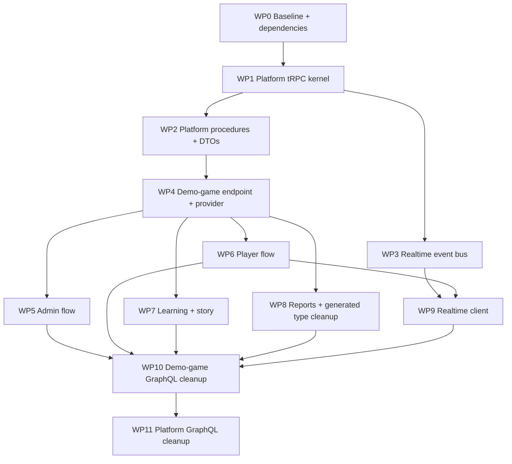

# tRPC Migration Work Package Index

Date: 2026-05-06

Branch: `codex/trpc-migration-work-packages`

Scope: `packages/platform` and `apps/demo-game`.

This file is the coordination index only. Detailed implementation plans live in the linked work-package files under `project/trpc-migration-work-packages/`.

## Migration Frame

Migrate incrementally:

1. Add tRPC next to the existing GraphQL/Apollo stack.
2. Move demo-game call sites to tRPC in vertical slices.
3. Remove GraphQL only after all Apollo and generated GraphQL imports are gone.

Graphify sanity check: the true coupling points are `GameService.ts`, `PlayService.ts`, `EventService.ts`, admin game detail, cockpit, reports/type helpers, and GraphQL/Apollo cleanup boundaries. The work packages are split around those boundaries.

## Dependency Graph



Parallel waves:

- Wave 1, serial: `WP0 -> WP1`.
- Wave 2, parallel after `WP1`: `WP2` and `WP3`.
- Wave 3, serial bridge: `WP4` after `WP2`.
- Wave 4, parallel after `WP4`: `WP5`, `WP6`, `WP7`, `WP8`.
- Wave 5: `WP9` after `WP3` and `WP6`.
- Wave 6, serial cleanup: `WP10 -> WP11`.

## Work Package Files

| Package | Detailed plan                                                                                                                   |
| ------- | ------------------------------------------------------------------------------------------------------------------------------- |
| `WP0`   | [`wp00-baseline-and-dependencies.md`](trpc-migration-work-packages/wp00-baseline-and-dependencies.md)                           |
| `WP1`   | [`wp01-platform-trpc-kernel.md`](trpc-migration-work-packages/wp01-platform-trpc-kernel.md)                                     |
| `WP2`   | [`wp02-platform-procedures-and-dtos.md`](trpc-migration-work-packages/wp02-platform-procedures-and-dtos.md)                     |
| `WP3`   | [`wp03-realtime-event-bus.md`](trpc-migration-work-packages/wp03-realtime-event-bus.md)                                         |
| `WP4`   | [`wp04-demo-game-trpc-endpoint-provider.md`](trpc-migration-work-packages/wp04-demo-game-trpc-endpoint-provider.md)             |
| `WP5`   | [`wp05-admin-game-management-client.md`](trpc-migration-work-packages/wp05-admin-game-management-client.md)                     |
| `WP6`   | [`wp06-player-onboarding-and-cockpit-core.md`](trpc-migration-work-packages/wp06-player-onboarding-and-cockpit-core.md)         |
| `WP7`   | [`wp07-learning-and-story-components.md`](trpc-migration-work-packages/wp07-learning-and-story-components.md)                   |
| `WP8`   | [`wp08-reports-and-generated-type-cleanup.md`](trpc-migration-work-packages/wp08-reports-and-generated-type-cleanup.md)         |
| `WP9`   | [`wp09-realtime-client.md`](trpc-migration-work-packages/wp09-realtime-client.md)                                               |
| `WP10`  | [`wp10-demo-game-graphql-cleanup.md`](trpc-migration-work-packages/wp10-demo-game-graphql-cleanup.md)                           |
| `WP11`  | [`wp11-platform-graphql-compatibility-cleanup.md`](trpc-migration-work-packages/wp11-platform-graphql-compatibility-cleanup.md) |

## Shared Rules

- Keep write scopes strict.
- Do not remove GraphQL files before `WP10`/`WP11`.
- Keep package versions pinned and lockfiles synchronized.
- Use Context7 for current tRPC docs before implementing tRPC code.
- Prefer DTO helpers over broad Prisma object returns.
- Prefer React Query invalidation before optimistic cache logic.
- Every work package must report verification commands and whether failures were pre-existing or newly introduced.

## Integration Checks

Before merging parallel work:

- Re-run the final audit commands.
- Check for conflicting edits across work packages.
- Run platform build.
- Run demo-game check, tests, and build.
- Run runtime browser smoke checks for admin, player, reports, and realtime.

Final audit commands:

```bash
rg -n "@apollo/client|graphql-yoga|graphql-sse|graphql-codegen|src/graphql/generated|/api/graphql" apps/demo-game packages/platform
rg -n "@trpc|@tanstack/react-query|superjson|zod" apps/demo-game packages/platform package.json pnpm-lock.yaml
pnpm --filter @gbl-uzh/platform build
pnpm --filter @gbl-uzh/demo-game check
pnpm --filter @gbl-uzh/demo-game test
pnpm --filter @gbl-uzh/demo-game build
```
